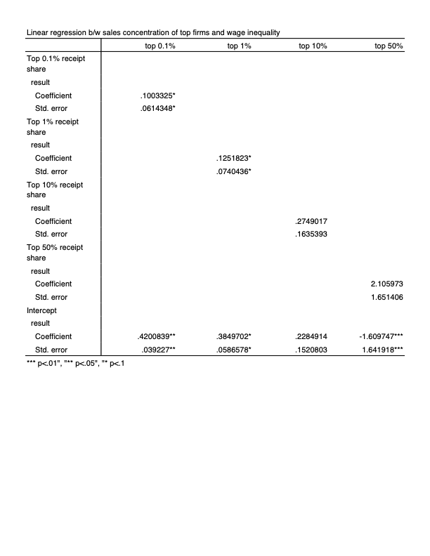

# Sales Concentration by Large Firms and Wage Inequality
## Data sorces
Anlaysis of this research is consisted of four parts(three for main analysis and one for supplimental analysis)
Analysis (concentration vs wage inequality)
Target range                    | datasets - (wether obtained already?)
------------------------------- | ---------------------------------------------------------------
1.Entire market.                | a.Concentration – Yes(1959-2018) b.Wage – Yes(1969-2021)
2.By Industry.                  | a.Concentration – Yes(1959-2018) b.Wage – Yes(1969-2021)
3.By Occupation×Industry.       | a.Concentration – Yes(1959-2018) b.Wage – Yes(1969-2021)
4.By Firm×Industry(supplimental)| a.Concentration – Yes(1959-2018) c.Scraping(2021?) - On process

Datasets are stored below:
a. Sales Concentration(https://drive.google.com/drive/folders/1REoUazv3zmBZGkrBYfjohFTKdIisw4CX?usp=sharing)
b. Wage: Entire market(agg_concent_R1(1).dta) and by industry(sector_concent_R1.dta)
c. On process:Refering codings from the previous project by Baotong Zhang, Guangyuan Chen, Sophie Wang, and Zhe Zhang(data_scraping.ipynb)

I used STATA software for this analysis and code is wirtten in do-files(details blow)
1. cps_00002.do - to clean up dat raw data for wage to stata data file with labels
2. clean_agg_con_data.do - clean up data and cacluclate gini coefficient for wages

## Initial Findings
First, there is an increasing trends of market concentration

Correlation with top 0.1% and 1% is statisitically significant

Belowsa are notes for lisence to use the concentration database:
  1.  "               US corporate concentration database                        " 
  2.  "==========================================================================" 
  3.  "                  Use subject to Creative Commons                         " 
  4.  " Attribution-NonCommercial-ShareAlike 4.0 International (CC-BY-NC-SA 4.0) "
  5.  "     For full license see:                                                " 
  6.  "     https://creativecommons.org/licenses/by-nc-sa/4.0/legalcode          " 
  7.  "     Below is a human-readable summary from:                              " 
  8.  "     https://creativecommons.org/licenses/by-nc-sa/4.0/                   " 
  9.  "--------------------------------------------------------------------------" 
 10.  " Attribution-NonCommercial-ShareAlike 4.0 International (CC-BY-NC-SA 4.0) "
 11.  "     This is a human-readable summary of (and not a substitute for)       "
 12.  "     the license.                                                         "
 13.  "                                                                          "
 14.  "     * You are free to: *                                                 "
 15.  "       Share --                                                           " 
 16.  "         copy and redistribute the material in any medium or format       "
 17.  "       Adapt --                                                           " 
 18.  "         remix, transform, and build upon the material                    "
 19.  "                                                                          "
 20.  "     The licensor cannot revoke these freedoms as long as you follow      " 
 21.  "     the license terms.                                                   " 
 22.  "                                                                          "
 23.  "     * Under the following terms: *                                       "
 24.  "       Attribution --                                                     "
 25.  "          You must give appropriate credit, provide a link to the         " 
 26.  "          license, and indicate if changes were made. You may do so       " 
 27.  "          in any reasonable manner, but not in any way that               " 
 28.  "          suggests the licensor endorses you or your use.                 "
 29.  "       NonCommercial --                                                   "
 30.  "         You may not use the material for commercial purposes.            "
 31.  "       ShareAlike --                                                      "
 32.  "         If you remix, transform, or build upon the                       " 
 33.  "         material, you must distribute your contributions under the same  " 
 34.  "         license as the original.                                         "
 35.  "       No additional restrictions --                                      "
 36.  "        You may not apply legal terms or technological measures that      "
 37.  "        legally restrict others from doing anything the license permits.  "
 38.  "                                                                          "
 39.  "     * Notices: *                                                         "
 40.  "     You do not have to comply with the license for elements of the       " 
 41.  "     material in the public domain or where your use is permitted by an   " 
 42.  "     applicable exception or limitation. No warranties are given. The     " 
 43.  "     license may not give you all of the permissions necessary for        " 
 44.  "     your intended use. For example, other rights such as publicity,      " 
 45.  "     privacy, or moral rights may limit how you use the material.         " 
 46.  "=========================================================================="
 47.  "                                                                          "
 48.  " To comply with the attribution requirement in the license, whenever it   "
 49.  " is used the dataset must be cited as follows: Spencer Kwon, Yueran Ma,   "
 50.  " Kaspar Zimmermann. 2022. 100 Years of Rising Corporate Concentration.    "
 51.  " We advise making explicit reference to the date when the database was    "
 52.  " consulted, as statistics are subject to revisions.                       "
