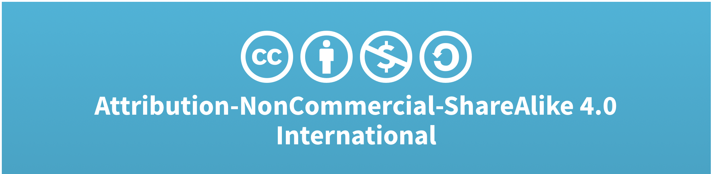
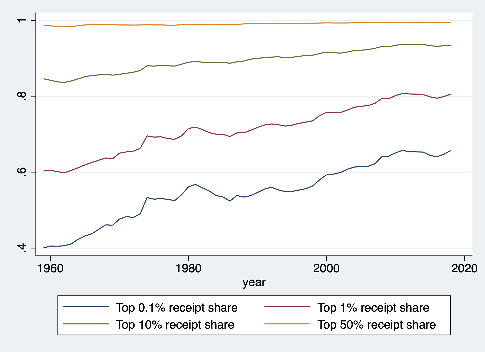
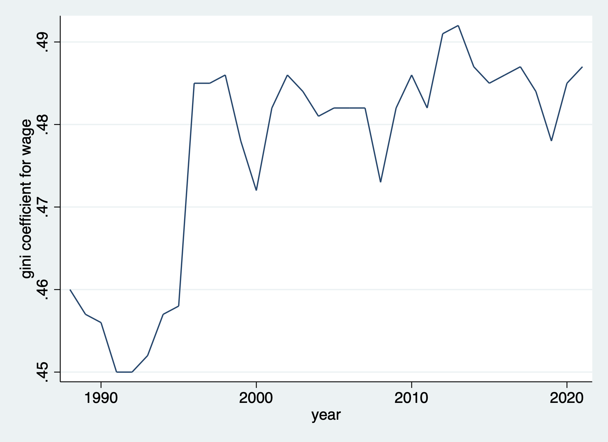

# Sales Concentration by Large Firms and Wage Inequality
## Data sorces
I used STATA_SE17.0 for this research
Anlaysis of this research is consisted of four parts(three for main analysis and one for supplimental analysis)
Analysis (concentration vs wage inequality)
Target range                    | datasets - (wether obtained already?)
------------------------------- | ---------------------------------------------------------------
1.Entire market.                | a.Concentration – Yes(1959-2018) b.Wage – Yes(1969-2021)
2.By Industry.                  | a.Concentration – Yes(1959-2018) b.Wage – Yes(1969-2021)
3.By Occupation×Industry.       | a.Concentration – Yes(1959-2018) b.Wage – Yes(1969-2021)
4.By Firm×Industry(supplimental)| a.Concentration – Yes(1959-2018) c.Scraping(2021?) - On process

Datasets are stored below:
1. a)Sales Concentration(https://drive.google.com/drive/folders/1REoUazv3zmBZGkrBYfjohFTKdIisw4CX?usp=sharing): Citation for license permission is noted at the end of this file. License looks like below and this research follows the same license format(https://creativecommons.org/licenses/by-nc-sa/4.0/legalcode)

3. b)Wage: Entire market(agg_concent_R1(1).dta) and by industry(sector_concent_R1.dta): Citatation/bibliography would be created via https://bibliography.ipums.org/
4. c)Wage: On process-Refering codings from the previous project by Baotong Zhang, Guangyuan Chen, Sophie Wang, and Zhe Zhang(data_scraping.ipynb): I will cite them accordingly

I used STATA software for this analysis and code is wirtten in do-files(details blow)
1. cps_00003.do - to clean up dat raw data for wage to stata data file with labels
2. clean_agg_con_data.do - clean up data and cacluclate gini coefficient for wages

## Initial Findings
Belows are initial findings of analysis. First figure shows historical trends of market concentration of sales as sales share or top 0.1%, 1%, 10%, and 50% from 1959 to 2018. While share of top50% has not changed much, top 0.1% and 1% share has been increasing. Next figure shows the historical trend of wage inequality, utilizig gini coefficient of wage, from 1989 to 2021. Higher number means more inequality among the wage distribution. The last table shows results of OLS regression between wage gini coefficient with market concentration of sales as sales share or top 0.1%, 1%, 10%, and 50% in the time period of 1989-2018. It shows that correlations with top 0.1% and 1% are positive and statisitically significant. Those results are crutial because, as for entire market and ignoring other covariates, there seems correlation between market concentration and wage inequality, meaning that the increase in sales share of top large firms could lead higher wage inequality among labor. This could be scrutinized further to see what would be composition of this correlation. Next, this research would check this correlation by industry and occupation.

Regression b/w wage inequality and market concentration
|                          | top 0.1% | top 1% | top 10%  | top 50%  |
| ------------------------ | -------- | ------ | -------- | -------- |
| Coefficient              |          |        |          |          |
|   Top 0.1% receipt share | .227**   |        |          |          |
|   Top 1% receipt share   |          | .291** |          |          |
|   Top 10% receipt share  |          |        | .713     |          |
|   Top 50% receipt share  |          |        |          | 7.03     |
|   Intercept              | .34**    | .254** | -.178*** | -6.51*** |
| Std. error               |          |        |          |          |
|   Top 0.1% receipt share | .039**   |        |          |          |
|   Top 1% receipt share   |          | .048** |          |          |
|   Top 10% receipt share  |          |        | .117     |          |
|   Top 50% receipt share  |          |        |          | 1.19     |
|   Intercept              | .024**   | .036** | .107***  | 1.18***  |
*** p<.01, ** p<.05, * p<.1
## Citation
Belows are notes for lisence to use the concentration database:
  1.  "               US corporate concentration database                        " 
  2.  "==========================================================================" 
  3.  "                  Use subject to Creative Commons                         " 
  4.  " Attribution-NonCommercial-ShareAlike 4.0 International (CC-BY-NC-SA 4.0) "
  5.  "For full license see:                                                     " 
  6.  "https://creativecommons.org/licenses/by-nc-sa/4.0/legalcode               " 
  7.  " Below is a human-readable summary from:                                  " 
  8.  " https://creativecommons.org/licenses/by-nc-sa/4.0/                       " 
  9.  "--------------------------------------------------------------------------" 
 10.  " Attribution-NonCommercial-ShareAlike 4.0 International (CC-BY-NC-SA 4.0) "
 11.  "     This is a human-readable summary of (and not a substitute for)       "
 12.  "     the license.                                                         "
 13.  "                                                                          "
 14.  "     * You are free to: *                                                 "
 15.  "       Share --                                                           " 
 16.  "         copy and redistribute the material in any medium or format       "
 17.  "       Adapt --                                                           " 
 18.  "         remix, transform, and build upon the material                    "
 19.  "                                                                          "
 20.  "     The licensor cannot revoke these freedoms as long as you follow      " 
 21.  "     the license terms.                                                   " 
 22.  "                                                                          "
 23.  "     * Under the following terms: *                                       "
 24.  "       Attribution --                                                     "
 25.  "          You must give appropriate credit, provide a link to the         " 
 26.  "          license, and indicate if changes were made. You may do so       " 
 27.  "          in any reasonable manner, but not in any way that               " 
 28.  "          suggests the licensor endorses you or your use.                 "
 29.  "       NonCommercial --                                                   "
 30.  "         You may not use the material for commercial purposes.            "
 31.  "       ShareAlike --                                                      "
 32.  "         If you remix, transform, or build upon the                       " 
 33.  "         material, you must distribute your contributions under the same  " 
 34.  "         license as the original.                                         "
 35.  "       No additional restrictions --                                      "
 36.  "        You may not apply legal terms or technological measures that      "
 37.  "        legally restrict others from doing anything the license permits.  "
 38.  "                                                                          "
 39.  "     * Notices: *                                                         "
 40.  "     You do not have to comply with the license for elements of the       " 
 41.  "     material in the public domain or where your use is permitted by an   " 
 42.  "     applicable exception or limitation. No warranties are given. The     " 
 43.  "     license may not give you all of the permissions necessary for        " 
 44.  "     your intended use. For example, other rights such as publicity,      " 
 45.  "     privacy, or moral rights may limit how you use the material.         " 
 46.  "=========================================================================="
 47.  "                                                                          "
 48.  " To comply with the attribution requirement in the license, whenever it   "
 49.  " is used the dataset must be cited as follows: Spencer Kwon, Yueran Ma,   "
 50.  " Kaspar Zimmermann. 2022. 100 Years of Rising Corporate Concentration.    "
 51.  " We advise making explicit reference to the date when the database was    "
 52.  " consulted, as statistics are subject to revisions.                       "

Citation for wage data from CPS
Sarah Flood, Miriam King, Renae Rodgers, Steven Ruggles, J. Robert Warren and Michael Westberry. Integrated Public Use Microdata Series, Current Population Survey: Version 9.0 [dataset]. Minneapolis, MN: IPUMS, 2021.
https://doi.org/10.18128/D030.V9.0
